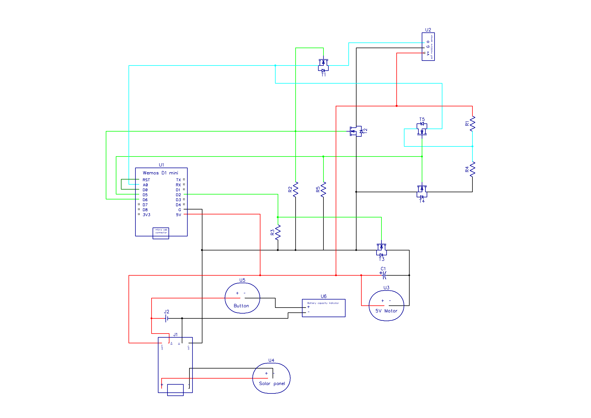

# Circuit Diagram
Made in DipTrace program

Components:
<ul>
<li>U1 - Wemos D1 mini (microcontroller)</li>
<li>U2 - Capacitive soil moisture sensor V1.2 (built on NE555 chip)</li>
<li>U3 - 5V DC motor (submersible water pump)</li>
<li>U4 - 1 watt small solar pannel</li>
<li>U5 - push button switch</li>
<li>U6 - battery charge indicator</li>
<li>J1 - battery charger module 03962A</li>
<li>J2 - 18650 Li-Ion battery</li>
<li>R1, R2, R3, R4, R5 - 10K Ohm resistors</li>
<li>C1 - 16V 100µF capacitor</li>
<li>T1, T2, T3, T4, T5 - FQP30N06 MOSFET transistors</li>
</ul>

